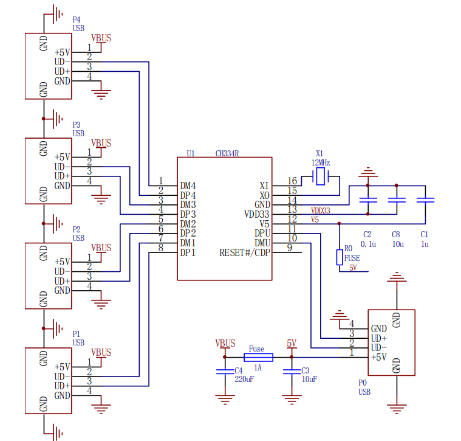

# 集成Windows Hello指纹、DIAL、HUB的桌面工具——复刻

开源地址：[集成Windows Hello指纹、DIAL、HUB的桌面工具](https://oshwhub.com/pomin/integrated-desktop-tool-windowsh)

作者：[pomin](https://oshwhub.com/pomin)

USB HID设备查询(码表和类型):[HID Usages and Descriptions](https://www.usb.org/sites/default/files/hut1_21_0.pdf)


## 环境准备

本项目主控使用CH554T主控，使用keil C51工具链，需要准备相应环境，自行到官网下载安装`c51v954a.exe`。

然后需要向keil中添加WCH芯片，见[博客](https://blog.csdn.net/Dr_Haven/article/details/120263663)。问题解决:[器件库怎么导入Keil](https://www.wch.cn/bbs/thread-94733-1.html)

注意，由于沁恒的cdb是放在了`uv4`目录下，而可能下载工具添加的位置放在了`[ARM]`分节下，导致找不到文件，因此需要找到工具添加的`CDB0=UV4\WCH.CDB ("WCH MCU Database")`这一行并将其放到`[UV2]`这一节中。

## 芯片用法

### CH334R

CH334是USB2.0协议的4端口USB HUB控制器芯片，上行端口支持USB2.0高速和全速，下行端口支持USB2.0高速全速和低速，支持STT和MTT模式。(节选自数据手册)

#### 设计要点

在使用时，该芯片(CH334R)有以下几个特点需要注意：

* 内置信号线上下拉电阻，无需额外上下拉
* 内置LDO5V转3.3V
* 6KV 增强 ESD 性能，Class 3A

其他高级功能为该系列其他型号的芯片，见数据手册1.2节。

> 该系列芯片的过流保护需要外置电源开关，而本设计中SY6280功率开关已经有电流检测功能

该芯片复位引脚为低电平使能，自带上拉，不用时可浮空。

该芯片自带的LDO对外输出能力为20mA。

该芯片官方推荐简化设计如图：



其中：

1. R0为100mA保险丝，简化中可以短接。
2. Fuse为保险丝，可替换为限流开关（如本设计中的SY6280）。
3. 建议将5V和VDD33都连接到外置3.3电源，减小发热和功耗，此时C8和C2可合并为1uF。
4. 热拔插瞬间，由于压降触发复位，可能出现USB断联，可以通过增大5V供电电容。
5. X0悬空，X1接地可免晶振，但部分封装形式默认未开启，可在订购时确认。


### SR05

SR05是一个静电和浪涌保护瞬态抑制二极管(TVS)，用于保护高速数据接口免受ESD、EFT。lightining导致的过压过流。

该产品能保护两条信号线，5V的信号工作电压，产生小于10pF的电容。可用于USB 电源&数据线，Ethernet 10BaseT，IIC，芯片IO保护等，是功能很好用的一个片子。

#### 设计要点

内部电路结构如下：


具体原理见数据手册，其实就是二极管钳住了电位并用TVS控制浪涌。

USB线使用方式如下：


#### 应用电路


2和3脚接的顺序无所谓。

### SY6280

SY6280是一个功率开关，能够实现过流保护和过温保护，并防止电流倒灌。该芯片过流电流可调，并自带电容放电回路，工作电压2.4V-5.5V。

#### 设计要点

* 输入电压2.4V到5.5V
* EN高电平使能(2V以上)
* 输入使用10uF及以上的陶瓷电容来防止USB插入时的压降，输出电容滤波即可。
* ISET设置限流I(A)=6800/Rset

Layout要求见datasheet。


### CH554T

CH554 芯片是一款兼容 MCS51 指令集的增强型 E8051 内核单片机,支持最高 24MHz 系统主频，内置 16K 程序存储器 ROM 和 256 字节内部 iRAM 以及 1K 字节 片内 xRAM，xRAM 支持 DMA 直接内存存取。T——TSSOP-20

个人感觉最大特点是支持USB的51.

#### 设计要点

USB 全内置设计，P3.6 和 P3.7 引脚用于 USB 时不能串接电阻，且电压为内部3.3V不支持5V。

RST引脚内置下拉电阻；其它GPIO默认有上拉电阻。

无论是在板编程或者是通过串口或 USB 下载程序，都必须临时使用 5V 电源电压

3.3V供电，VCC和V33接外部3.3V，且都要有对地大于等于0.1uF电容。

5V供电，VCC接外部5V，V33内部3.3V输出，且都要有对地大于等于0.1uF电容。

> 原设计中只接了3.3V的电源，如果买到旧片子就会很难受，这里添加一点修改。

## 电路修改

结合上面的芯片使用介绍，这里对该项目进行一些修改，减少芯片使用量，降低成本（让我少焊点）。

1. 删除两个USB端口的SY6280。
2. 将TYPEC输入的F1保险丝，换成SY6280，并设置限流500mA（R=13.6k）。
3. SY6280的EN直接拉到输入。
4. USBHUB晶振换成直插晶振。
5. 给CH554T供电添加3.3V和5V的短接选择。


## 代码解析与修改

先看main函数：

```c
void main(void) {
    init();

    while (1) {
        mDelaymS(1);
        systime_ms++;
        for (scheduler_index = 0; scheduler_index < task_num;scheduler_index++) {
            if (systime_ms - systemTasks[scheduler_index].last_run >systemTasks[scheduler_index].cycle_length) 
						{
                systemTasks[scheduler_index].last_run = systime_ms;
                systemTasks[scheduler_index].task();
            }
        }
    }
}
```

先不管初始化，首先看循环中的伪多线程实现。

```c
volatile unsigned int data systime_ms;//系统时间

typedef struct {
    void (*task)(void);
    unsigned int cycle_length;
    unsigned int last_run;
} task_s;

static task_s systemTasks[] = {
    {TASK_CYCLE_1, 1, 0},
    {TASK_CYCLE_2, 1, 0},
    {TASK_CYCLE_20, 20, 0},
};
```

代码中定义了一个数据结构，并创建了一个数组。在main中用`systime_ms`进行计数。在每轮循环中检测每个任务的上次运行时间，当距上次运行时间已经达到设定值，就执行该任务。该程序本质上就是个软件定时器，`cycle_length`设置任务每隔多少次循环运行一次。这样选择性的减少某些耗时但是低频率任务的运行次数，可以提高系统的响应速度。

之后再看看三个任务：

```c
static void TASK_CYCLE_1(void) {
    static uint idata sw_num = 0;
    if (IO_EC11_D == 0) {
        sw_num++;
        if (sw_num == 5) {
            drv_usb_dial(1);
        }
    } else {
        if (sw_num >= 5) drv_usb_dial(0);
        sw_num = 0;
    }
}
```

该任务是Dial旋钮相关的任务，每个循环执行一次。`IO_EC11_D`是编码器的按钮，该代码的检查旋钮按下，发现长按就会执行`drv_usb_dial(1)`，从长按退出后就会执行`drv_usb_dial(0)`，交给电脑判断长按短按。这两个函数向USB传输数据，具体内容后面再讲。

```c
static void TASK_CYCLE_2(void) {
    key_scan();
    if (key_msg) {
        key_act();
        key_msg = 0;
    }
}

static void TASK_CYCLE_20(void) {
    if (key_msg) {
        key_act();
        key_msg = 0;
    }
}
```

剩下两个任务负责**处理按键信息**。前一个每个循环执行一次，后一个每20个循环执行一次。第二个是多余的代码，这里直接删了。

`key_scan()`：

```c
/* 按键扫描 */
void key_scan(void) {
    // 0 - 2 是 3 个按键, 3 是 EC11 B 脚
    UINT8X i;
    EC11_B_BACK_STA = EC11_B_NOW_STA;
    EC11_B_NOW_STA = IO_EC11_B;

    /* EC11 响应 上升沿/下降沿全触发 抵消不灵敏的感觉 */
    if (!EC11_B_NOW_STA && EC11_B_BACK_STA) {
        if (IO_EC11_A) {
            key_msg = 22;  // 顺时针
        } else {
            key_msg = 21;  // 逆时针
        }
    }
    /* 普通按键扫描 */
    for (i = 0; i < 3; i++) {
        back_state[i] = key_state[i];
    }
    key_state[0] = IO_KEY0;
    key_state[1] = IO_KEY1;
    key_state[2] = IO_KEY2;

    for (i = 0; i < 3; i++) {
        if (key_state[i] && !back_state[i]) {
            key _msg = i + 1;
        }
    }
}
```

该函数用于读取输入，包括旋钮旋转和普通按键。读取按键都需要两个循环的时间，只检测边缘变化。对于旋钮，在B边缘变化时检测A的电平来判断旋转方向；对于按键，检测上升沿。

`key_act()`：

```c
/* 按键动作函数 */
void key_act(void) {
    switch (key_msg) {
        case 1:
            drv_usb_mul_click(HID_CONSUMER_SCAN_PREV_TRK);
            break;
        case 2:
            drv_usb_mul_click(HID_CONSUMER_PLAY_PAUSE);
            break;
        case 3:
            drv_usb_mul_click(HID_CONSUMER_SCAN_NEXT_TRK);
            break;
        case 4:
            break;
        case 21:
            drv_usb_dial(200);
            break;
        case 22:
            drv_usb_dial(-200);
            break;
        default:
            break;
    }
}
```

该函数用于处理读取到的按键事件，修改按键的定义就是在这里进行。这里会涉及几个特定的函数：

```c
void drv_usb_dial(int wheel)
```

该函数用于发送和旋钮有关的数据，其中wheel等于1表示Dial旋钮按下，0表示旋钮松开。 

```c
void drv_usb_mul_click(uchar dat)
```

该函数用于发送多媒体按钮点击数据，具体传参可见`keycode.h`文件中的定义。该函数调用两次`drv_usb_mul()`上报数据，一次按下，一次松开。

```c
void drv_usb_keyboard(uchar *p)
```

上报按键数据数组，只需要包含8个字节按键数据的数组。需要连续调用两次才能是按键点击的效果，否则就是长按，这里添加代码实现单键点击功能：

```c
/**
 * @brief 普通单按键点击的实现,无输入验证
 * example-drv_usb_keyboard_click(KEY_Left_Control|KEY_Left_Alt,HID_KEYBPAD_DOT)任务管理器快捷键
 * @param status Modifier keys status
 * @param key the normal key
**/
void drv_usb_keyboard_click(uchar status,uchar key) {
    HIDKey[0]=status;//控制键
    HIDKey[2]=key;//按键
	
		FLAG = 0;
		drv_usb_keyboard(HIDKey);
		while (FLAG == 0);//等待发送完毕
		HIDKey[0]=0;//全部归零
    HIDKey[2]=0;
		drv_usb_keyboard(HIDKey);
		while (FLAG == 0);
}
```

> USB键盘输入的上报数据
>
> [原文](https://blog.csdn.net/guoqx/article/details/122020615)
>
> 在本项目中，模拟键盘输入需要发送9个字节数据，其中第一个字节恒定为1(本设计中USB描述符的设定)，剩下8个字节为正常按键数据。其结构如下：
>
> {1,控制键,0,按键1,按键2,按键3,按键4,按键5,按键6}
>
> 其中，控制键每个位表示不同的控制按钮，可以输入KEY_Left_Control | KEY_Left_Alt 表示Ctrl+Alt 
>
> 剩余按键为正常的按键，如HID_KEYBOARD_F6为按下F6，没有按下就填0
>
> 只需要在按键变动时上报数据，上报当前按下的按钮，依次排列，没有就是0,。

然后看一下初始化函数`init()`：

```c
void init(void) {
    UINT8X i;
    CfgFsys();       // CH552时钟选择24M配置
    mDelaymS(100);   // 修改主频等待内部晶振稳定,必加
    drv_usb_init();  // USB设备模式初始化
    EA = 1;          // 允许单片机中断
    UEP2_T_LEN = 0;  // 清空端点2发送长度
    FLAG = 0;        // 清空USB中断传输完成标志
    IO_KEY0 = 1;     // 硬件已经上/下拉, 此处初始置1/0即可
    IO_KEY1 = 1;
    IO_KEY2 = 1;

    IO_USB_EN1 = 1;
    IO_USB_EN2 = 1;

    IO_EC11_A = 1;
    IO_EC11_B = 1;
    IO_EC11_D = 1;
    if (!IO_EC11_D)
    {
        jmp_bootloader();
    }
}
```

这个函数没什么多说的，就是初始化外设并设置IO口初始状态。这里注意，通过读取`IO_EC11_D`即旋钮是否按下，选择是否进入bootload程序，这里用来在上电时通过按旋钮来进入boot模式用以更新固件。在本设计中`IO_USB_ENn`已经被弃用。

USB外设的控制部分比较复杂，这里不再多作解释（我也不会），这里只给出修改设备字符串描述符的步骤：

1. 使用工具生成数据。
2. 将数据复制到`usbcfg.c`中的`desc_manuf`和`desc_produce`数组中。

## USB HID报告描述符

### 设备描述符说明

[参考文章](https://zhuanlan.zhihu.com/p/27568561)

基于上述文章，我们看看第二个COLLECTION，也就是上报点为2的用于键盘特殊功能输入的设备描述符。

```c
    /* consumer */
    0x05, 0x0c,        // USAGE_PAGE (Consumer Devices)
    0x09, 0x01,        // USAGE (Consumer Control)
    0xa1, 0x01,        // COLLECTION (Application)
    0x85, 0x02,        // REPORT_ID (2) <-- 之后的上报键值依赖此 ID
    0x19, 0x00,        // USAGE_MINIMUM (Unassigned)
    0x2a, 0x3c, 0x03,  // USAGE_MAXIMUM
    0x15, 0x00,        // LOGICAL_MINIMUM (0)
    0x26, 0x3c, 0x03,  // LOGICAL_MAXIMUM (828)
    0x95, 0x01,        // REPORT_COUNT (1)
    0x75, 0x18,        // REPORT_SIZE (24)
    0x81, 0x00,        // INPUT (Data,Ary,Abs)
    0x05, 0x01,        // USAGE_PAGE 用途页0x01(普通桌面)
    0x19, 0x00,        // USAGE_MINIMUM 用途最小值0x00(未定义)
    0x29, 0x83,        // USAGE_MAXIMUM 用途最大值0x83(系统唤醒)
    0x15, 0x00,        // LOGICAL_MINIMUM (0)
    0x25, 0x83,        // LOGICAL_MAXIMUM (83)
    0x75, 0x08,        // REPORT_SIZE (8)
    0x95, 0x01,        // REPORT_COUNT (1)
    0x81, 0x00,        // INPUT (Data,Ary,Abs)输入1字节数据    
    0xc0,              // END_COLLECTION  /* 25 */
```

让我们拆开分析：

```c
    /* consumer */
    0x05, 0x0c,        // USAGE_PAGE (Consumer Devices)
    0x09, 0x01,        // USAGE (Consumer Control)
    0xa1, 0x01,        // COLLECTION (Application)
    ***
    ***
    0xc0,              // END_COLLECTION  /* 25 */
```

首先，这里告知电脑这是一个Consumer Devices，可以支持相关的各种功能按键，将详细的描述放到COLLECTION中统一上报。

```c
    0x85, 0x02,        // REPORT_ID (2) <-- 之后的上报键值依赖此 ID
```

设置上报点为2，即上报数据的第一个字节为2。

```c
    0x19, 0x00,        // USAGE_MINIMUM (Unassigned)
    0x2a, 0x3c, 0x03,  // USAGE_MAXIMUM
    0x15, 0x00,        // LOGICAL_MINIMUM (0)
    0x26, 0x3c, 0x03,  // LOGICAL_MAXIMUM (828)
```

上面两行指定了使用USAGE中0-828的用法，下面两行指定上传数据的范围为0-828.具体用法见[码表查询](https://www.cnblogs.com/ahuo/archive/2010/10/07/1844882.html)。

```c
    0x95, 0x01,        // REPORT_COUNT (1)
    0x75, 0x18,        // REPORT_SIZE (24)
    0x81, 0x00,        // INPUT (Data,Ary,Abs)
```

指定上传一单位数据，一单位长度为24bit，INPUT将数据发送到电脑。

```c
 0x05, 0x01,        // USAGE_PAGE 用途页0x01(普通桌面)
```

切换到普通桌面(Generic Desktop)用法集合。

```c
    0x19, 0x00,        // USAGE_MINIMUM 用途最小值0x00(未定义)
    0x29, 0x83,        // USAGE_MAXIMUM 用途最大值0x83(系统唤醒)
    0x15, 0x00,        // LOGICAL_MINIMUM (0)
    0x25, 0x83,        // LOGICAL_MAXIMUM (83)
```

使用其中0-83的用法，并限制输入数据的范围为0-83.

```c
    0x75, 0x08,        // REPORT_SIZE (8)
    0x95, 0x01,        // REPORT_COUNT (1)
    0x81, 0x00,        // INPUT (Data,Ary,Abs)输入1字节数据    
```

上报一单位8bit的数据到电脑。

### 数据报文格式

综上，需要上报的数据格式如下：

```c
char data={2,Consumer1,Consumer2,Consumer3,Generic Desktop}
```

使用时，使用小端模式即最低有效字节位于最低地址，Consumer1为低字节，Consumer2为高字节。51使用大端模式。具体描述字节顺序[查看连接](https://www.usbzh.com/article/detail-524.html)。

### 简化与修改

这边为了简化代码，删除Generic Desktop功能（代码中只用到了其关机休眠的功能，这些用处太少）。

修改后设备描述符变为：

```c
    /* consumer */
    0x05, 0x0c,        // USAGE_PAGE (Consumer Devices)
    0x09, 0x01,        // USAGE (Consumer Control)
    0xa1, 0x01,        // COLLECTION (Application)
    0x85, 0x02,        // REPORT_ID (2) <-- 之后的上报键值依赖此 ID
    0x19, 0x00,        // USAGE_MINIMUM (Unassigned)
    0x2a, 0x3c, 0x03,  // USAGE_MAXIMUM
    0x15, 0x00,        // LOGICAL_MINIMUM (0)
    0x26, 0x3c, 0x03,  // LOGICAL_MAXIMUM (828)
    0x95, 0x01,        // REPORT_COUNT (1)
    0x75, 0x18,        // REPORT_SIZE (24)
    0x81, 0x00,        // INPUT (Data,Ary,Abs) 
    0xc0,              // END_COLLECTION  /* 25 */
```

新的数据上报函数为：

```c
void drv_usb_mul_click(uint16 dat) {
    FLAG = 0;
    drv_usb_mul(dat);
    while (FLAG == 0);
    drv_usb_mul(0);
    while (FLAG == 0);
}

void drv_usb_mul(uint16 dat) {
    char idata temp[4] = {2, 0, 0, 0};

    temp[1]=dat & 0xFF;
    temp[2]=(dat >> 8) & 0xFF;
		
    drv_usb_write_ep2(temp, 4);
}
```

* **注意**：记得修改函数声明，如果声明还是uchar，会强制转换为uchar。

与此同时，给出一些常用的按键：

```c
// Consumer 用户控制按钮
#define HID_CONSUMER_BRIGH_UP      0x6F  // Brightness Increment
#define HID_CONSUMER_BRIGH_DOWN    0x70  // Brightness Decrement
#define HID_CONSUMER_PLAY_PAUSE    0xCD  // Play/Pause
#define HID_CONSUMER_VOLUME_MUTE   0xE2  // Volume mute
#define HID_CONSUMER_VOLUME_UP     0xE9  // Volume Increment
#define HID_CONSUMER_VOLUME_DOWN   0xEA  // Volume Decrement
#define HID_CONSUMER_CALCULATOR    0x192 // Calculator
```

## 模块引脚


从右往左 ，依次为vcc d- d+ gnd。

## PC Dial开发

待续
